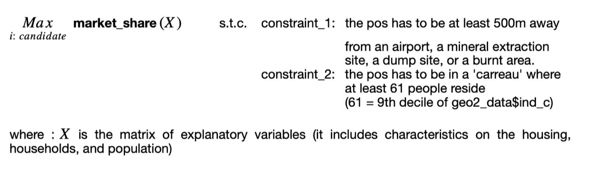

# Optimal point of sales

We built an interaction model to find the optimal point of sales in a spatial dataset, and created a [Shiny app](https://shiny.rstudio.com) to visualize the results : https://guillemforto.shinyapps.io/optimal_pos/?_ga=2.26939967.365306062.1589920607-1014726212.1589817691

**Authors:** Guillem FORTÓ / Caroline LEBRUN / Madeleine SMANIOTTO

**Date:** March - April 2020 
This project was part of the Géomarketing course of the M2 Statistics and Econometrics, at Toulouse School of Economics.

## Table of contents
* [Description](#description)
* [Running the code](#running-the-code)
* [Output](#output)
* [Additional information](#additional-information)
    * [1. Datasets](#1-datasets)
    * [2. Data files content]((#2-data-filescontent))
    * [3. Socioeconomic variables](#3-socioeconomic-variables)

## Description
The main idea was to train a spatial interaction model so that it could predict the market share of multiple point of sales (POS). Here are the steps we followed:
- We assembled all the features that are necessary to build a spatial interaction model in a single dataframe. Predictors included:
    - [INSEE IRIS](#1-datasets) socioeconomic data about the market zone where the POS was located ([see details](#2-socioeconomic-variables))
    - data on the number of competitors, extracted from the [SIRENE](#1-datasets) establishments database
    - travelling time (in mins) between the POS and its competitors

- Defined two constraints to add some restrictions to the model (see image below). At this point, the objective function, subject to the two constraints, could be written as follows:

- Once the model built, we applied it to at least 10 new randomly picked candidate shops from the SIRENE dataset. The one with the largest market share is then defined as the optimal position.

- Finally, we implemented everything on an interactive Shiny app that shows the best and the worst market zone, with at least one widget that explains the socioeconomic/competitors characteristics of each the zone.

## Running the code
- First thing to do is downloading all the data files and add them in a folder called 'data' in the root of the repository: https://www.dropbox.com/sh/hd8efvvby9qc8p7/AAAoTl7qWtc4VAKYEvMWrxDxa?dl=0.

- Also, you'll need to create an account on https://www.mapbox.com, and get a token map box from their API. Replace it at the beginning of the script (in `final_project.R`) once you have it.

- Change the variable `path` at the beginning of the script to the location of the data folder, in order to be able to load the data files. (e.g. if the data folder is located in '/Users/guillemforto/github/optimal_pos/data' then `path <- "~/github/optimal_pos"`)

- You are ready to open `final_project.R` with RStudio (>= version 1.2.5001 required) and execute the script. You may need to install several packages, but RStudio will propose to install them automatically if it detects you still don't have them.

## Output
The output table for best and worst candidate look like this:
- Best candidate

| SIREN | NIC | ... | longitude | latitude | geo_score | nbr_sensible_areas | second_constraint | sum_market | count_market |
| --- | --- | --- | --- | --- | --- | --- | --- | --- | --- |
| 530487263 | 10 | ... | 2.674524 | 45.86835 | 0.65 | 0 | TRUE | 2.705042 | 843 |

- Worst candidate

| SIREN | NIC | ... | longitude | latitude | geo_score | nbr_sensible_areas | second_constraint | sum_market | count_market |
| --- | --- | --- | --- | --- | --- | --- | --- | --- | --- |
| 332855691 | 207 | ... | 2.332238 | 48.87019 | 0.94 | 0 | TRUE | 0.2029933 | 578 |

and the RShiny application:

The green location is considered to be the best, and the red one the worst. Also, as you move the cursors and change the constraints in the left panel, the POSs automatically update on the map.

## Additional information
#### 1. Datasets
- **IRIS** (Ilots Regroupés pour l'Information Statistique) is a data set provided by [INSEE](https://www.insee.fr/fr/accueil), the national statistics bureau of France, with the aim of making geolocalized data about the French communes publicly available. It provides socio-demographic through a homogeneously grided zoning of the French territory. ([see details](https://www.insee.fr/fr/statistiques/2520034))
- **SIRENE** is a data set on companies and its characteristics. ([see details](https://www.data.gouv.fr/en/datasets/base-sirene-des-entreprises-et-de-leurs-etablissements-siren-siret/)). See also this [interactive platform]( https://data.opendatasoft.com/explore/dataset/sirene_v3%40public/?disjunctive.libellecommuneetablissement&disjunctive.etatadministratifetablissement&disjunctive.sectionetablissement&disjunctive.naturejuridiqueunitelegale&sort=datederniertraitementetablissement).
- **Landcover** is a European data set. It constitutes 'biophysical land use inventory which provides a complete picture of land use, at regular frequencies'. ([see details](https://www.statistiques.developpement-durable.gouv.fr/corine-land-cover-0?rubrique=348&dossier=1759))

#### 2. Data files content
- **geo1**: IRIS + plenty of variables + lat + lon + Polygons

- **market_zones**:
IRIS + sales + lat + lon + plenty of variables + mp + ms (our Y~X+eps) + Polygons

- **pos_sp** (point of sales data):	IRIS + lat + lon + pos_id

- **cl_sp** (customers data): IRIS + lat + lon + pos_id + cl_id + sales

- **geo2data** (INSEE 200m): idgeo2 + lat + lon + x + y + nbcar + ind_c

- **sirene** (competitors data): SIREN + plenty of variables

- **mp** (market potential): IRIS + mp

- **landcover** : ID + Code_12 + AREA_HA

#### 3. Socioeconomic variables

- Housing characteristics

| Name          | Description |
| ------------- |-------------|
| P14_LOG       | Nombre de logements |
| P14_LOGVAC    | Nombre de logements vacants |
| P14_MAISON    | Nombre de maisons |
| P14_APPART    | Nombre d'appartements |

- Characteristics of main residences

| Name          | Description |
| ------------- |-------------|
| P14_RP       | Nombre de résidence principales |
| P14_RP_3P       | Nombre de résidences principales de 3 pièces |
| P14_RP_4P       | Nombre de résidences principales de 4 pièces |
| P14_RP_5PP       | Nombre de résidences principales de 5 pièces ou plus |

- Household characteristics

| Name          | Description |
| ------------- |-------------|
| C14_MEN       | Nombre de ménages |
| C14_MENPSEUL       | Nombre de ménages d'une seule personne |
| C14_MENCOUPSENF       | Nombre de ménages dont la famille principale est formée d'un couple sans enfant |
| C14_MENCOUPAENF       | Nombre de ménages dont la famille principale est formée d'un couple avec enfant(s) |

- People characteristics

| Name          | Description |
| ------------- |-------------|
| P14_POP       | Population |
| P14_PMEN       | Nombre de personnes des ménages |
| P14_POPF       | Nombre total de femmes |
| P14_POP65P       | Nombre de personnes de 65 ans ou plus |
| C14_POP15P_CS3       | Nombre de personnes de 15 ans ou plus Cadres et Professions intellectuelles supérieures |
| C14_POP15P_CS5       | Nombre de personnes de 15 ans ou plus Employés |
| C14_POP15P_CS8       | Nombre de personnes de 15 ans ou plus Autres sans activité |
